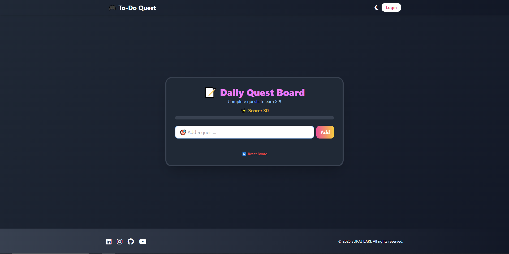

# 🎮 To-Do Quest – Gamified To-Do List Web App

Welcome to **To-Do Quest**, a fun, responsive, gamified task tracker that turns your daily goals into epic quests! Built using **HTML**, **Tailwind CSS**, and **JavaScript**, this mini web game boosts productivity with visual rewards, animations, and mobile-friendly design.

 <!-- Optional: Add a screenshot in your repo -->

---

## 🚀 Features

- ✅ Add, complete, and delete tasks (quests)
- 🌙 Dark mode toggle
- 📱 Fully responsive (mobile-first)
- 🎉 Confetti animation on task completion
- 🔥 Live XP progress bar + score system
- 🔔 Toast notifications for actions
- 💾 Auto-save tasks with localStorage
- 🔐 Mobile navigation with login mockup
- 📊 Gamified UI for motivation

---

## 📸 Preview

Live Demo: [To-Do Quest (GitHub Pages)](https://yourusername.github.io/todo-quest)

---

## 🛠️ Built With

- [Tailwind CSS](https://tailwindcss.com/)
- Vanilla JavaScript
- HTML5
- Font Awesome (icons)
- Confetti.js (animation)

---

## 🧩 How to Use

1. **Clone the repo**
   ```bash
   git clone https://github.com/yourusername/todo-quest.git
   cd todo-quest
